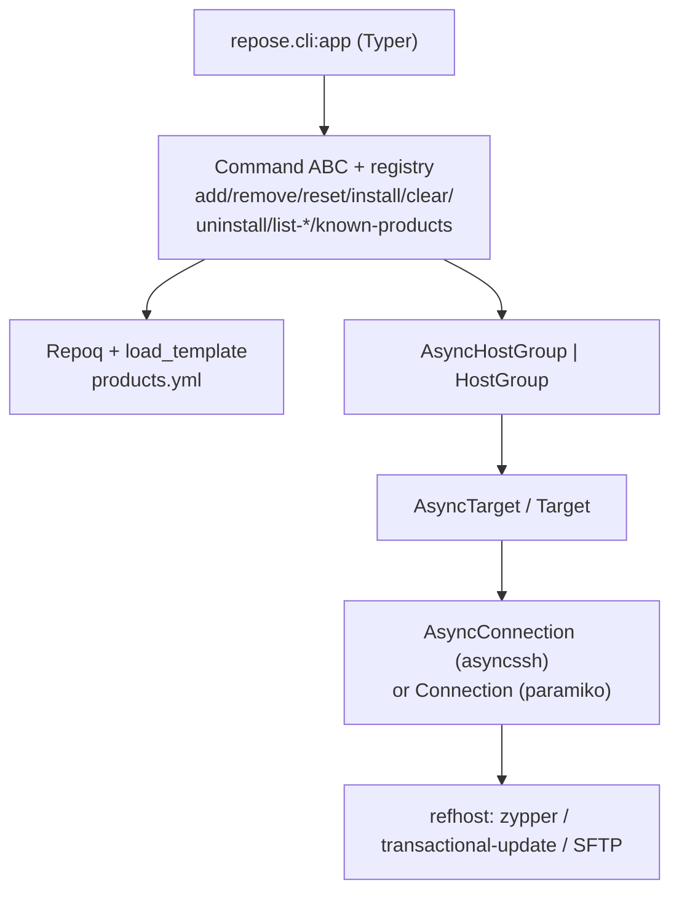
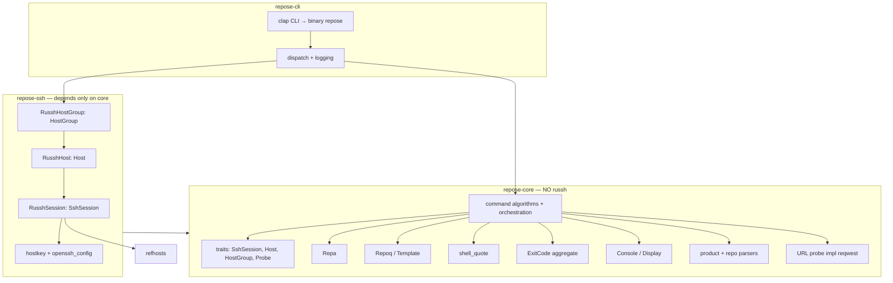
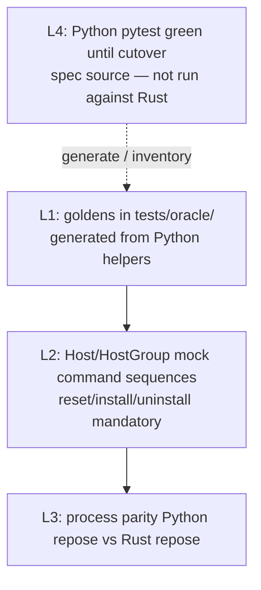
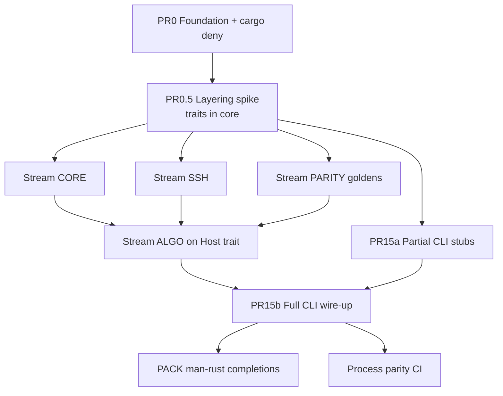

# Design Document: openSUSE/repose Rust Rewrite (In-Repo Replacement)

| Field | Value |
| --- | --- |
| **Title** | repose Rust rewrite — replace Python implementation |
| **Project** | openSUSE/repose |
| **Author** | TBD |
| **Date** | 2026-07-17 |
| **Status** | Draft (rev 4 — replace strategy; no dual-ship coexistence) |
| **Python baseline** | repose 2.1.0 (`repose/__init__.py`) |
| **License** | GPL-3.0-or-later (unchanged) |
| **End-state binary** | `repose` (Rust only; Python removed at cutover) |
| **Development branch** | `rewrite/rust` |
| **Rust version scheme** | `0.x` on the rewrite branch until cutover; then product version |
| **Shipping model** | **Replace**, not dual-package coexistence |

---

## Overview

**repose** is a CLI tool that manipulates zypper repositories and products on SUSE QAM refhosts over SSH. The current implementation is Python (~6.6k LOC under `repose/`), with a Typer CLI (`repose.cli:app`), dual SSH backends (asyncssh default + paramiko legacy), and a pytest suite that is the de-facto **specification source** of behavior.

This document proposes a **Rust rewrite that replaces the Python implementation in the same git repository**, developed on branch **`rewrite/rust`**. The goal is **replacement**, not dual-package coexistence: operators continue to install and run a single `repose` binary; the implementation language changes once, after parity is proven.

**During the rewrite (pre-cutover):**

- Python sources and pytest remain in-tree as the **reference implementation and behavioral oracle**.
- Rust lives under `crates/`; the Cargo binary is built as **`repose`** (or a temporary Cargo package name that installs as `repose` in packaging notes — never a long-lived `repose` (Rust) product).
- Process-level parity harnesses compare Rust output against Python `repose` where both still exist.

**At cutover (final PR on this branch / merge to master):**

- Python package (`repose/`, Typer entry points, Python-only deps, dual-backend code) is **removed**.
- Rust becomes the sole implementation; the shipped binary name remains **`repose`**.
- Man pages, completions, and packaging are Rust-owned only.

The Rust port:

1. Implements the **same CLI surface** (minus `--ssh-backend`).
2. Uses a **single async SSH stack** (not dual backends).
3. Treats the **Python asyncssh path** as the behavioral baseline (not paramiko-only quirks).
4. Lands incrementally via a **fan-out PR plan** so pure-logic, SSH, CLI, parity, and packaging workstreams can proceed in parallel after foundation.
5. Ends with a **delete-Python cutover PR** once Definition of Done is met — no multi-release dual-package window.

### Normative sources (conflict rule)

When behavior is ambiguous, resolve in this order:

1. **Committed golden vectors** under `tests/oracle/` (machine-checked).
2. **Python asyncssh-path source** (`repose/aiossh.py`, `AsyncTarget`/`AsyncHostGroup`, command `_arun` bodies, CLI defaults).
3. **This design document**.

Until a behavior has a golden, **Python code wins**. Design claims that diverge from Python must be fixed in the design or captured as intentional, tested deltas. **Intentional normative deltas** (allowed without matching Python hash-order / dual-backend / paramiko quirks):

1. Omit `--ssh-backend` (single SSH backend).
2. Fail closed on non-TTY password (no interactive prompt without a TTY).
3. ProxyJump not implemented except via expanded ProxyCommand.
4. **Stable sort of set-sourced multi-alias remote commands and dry-run lines** before `shlex.join` / emission (Python uses hash-order `set` iteration; Rust always sorts for deterministic argv and goldens — usually zypper-order-irrelevant, but it is still a deliberate remote-command delta, not test-only normalization).

---

## Background & Motivation

### Current architecture (Python)



Key modules and roles:

| Area | Path | Role |
| --- | --- | --- |
| CLI | `repose/cli.py` | Typer globals + 9 subcommands; Namespace shim → `Command` |
| Command base | `repose/command/_command.py` | Templates, fan-out, probe, reboot, aggregate exit codes |
| Commands | `repose/command/{add,remove,reset,install,clear,uninstall,list,known}.py` | Per-host algorithms + orchestration |
| REPA | `repose/types/repa.py` | `product:version:arch:repo` parse |
| Template | `repose/template/__init__.py`, `resolver.py` | YAML load + `Repoq.solve_repa` / `solve_product` |
| Host parse | `repose/host.py` | `[user@]host[:port]` → Target |
| Async SSH | `repose/aiossh.py` | connect, run, SFTP, accept-new, reboot helpers |
| Target | `repose/target/async_target.py`, `async_hostgroup.py` | products/repos I/O + isolated fan-out |
| Parsers | `repose/target/parsers/{product,repository}.py` | products.d / os-release / zypper -x lr |
| Output | `repose/console.py`, `display.py` | text + NDJSON |
| Probe | `repose/utils.py` | `check_repo_url(_async)` repomd.xml |

### Pain points driving the rewrite

1. **Dual SSH backends** double maintenance surface (`connection.py` ~629 LOC + `aiossh.py` ~701 LOC) and force parity tests for two transports that intentionally diverge on timeout UX.
2. **Python packaging / runtime cost** on large host cohorts: interpreter startup, GIL pressure on threaded paramiko path, and dependency weight.
3. **Distribution story**: a single distro-native Rust binary is easier to ship on constrained QAM tooling hosts.
4. **Long-term maintainability**: pure algorithms are unit-testable without SSH; crate layering makes that boundary explicit.

### Why keep Python in-tree during the rewrite (then delete it)

- QAM depends on repose daily; a rewrite without an oracle risks silent behavioral drift on reset/install/transactional paths.
- The pytest suite already encodes edge cases; it is a **specification source** (not an executable Rust suite).
- Keeping Python **green on the rewrite branch** until cutover provides a fall-back for developers and a process-parity oracle; it is **not** a plan to ship two packages.
- **Cutover is atomic from packaging's point of view:** one `repose` binary, one language. No `repose` (Rust) replacement release.

---

## Goals & Non-Goals

### Goals

1. **Behavioral parity** with Python **asyncssh default path** for all 9 subcommands, exit codes, NDJSON schema, dry-run previews, shell quoting, and transactional reboot/verify.
2. **In-repo replacement layout**: Rust workspace under `crates/` on branch `rewrite/rust`; one git history; end state is Rust-only.
3. **Python as temporary specification source + oracle**: while present, keep Python sources and pytest green; extract **committed goldens**; process-level CLI comparison against Python `repose`. Pytest is **not** executed against the Rust binary — it defines expected behavior that goldens and parity harnesses encode. **Python is deleted at cutover.**
4. **Single SSH backend** in Rust; **omit `--ssh-backend`** from the Rust CLI entirely.
5. **Incremental delivery**: foundation + layering spike first, then parallel workstreams.
6. **Ship artifacts**: same operator CLI surface (minus `--ssh-backend`), man pages, shell completions, GPL-3.0-or-later — all owned by Rust after cutover.
7. **Keep Python suite green until the cutover PR**; after cutover only `cargo`/Rust tests remain.
8. **Acyclic crate graph**: Host/session traits in `repose-core`; russh impl in `repose-ssh`; commands against traits in core.
9. **No dual-package coexistence**: do not ship Python and Rust `repose` packages to users in parallel.

### Non-Goals

| Non-goal | Rationale |
| --- | --- |
| Dual SSH backends in Rust | Explicit constraint; drop `--ssh-backend` |
| Dual-package replacement (`repose` + `repose` (Rust)) | **Replace** strategy; single shipped binary name |
| Paramiko quirk parity | No interactive timeout `"wait? (y/N)"`, no session-recycle loops |
| Rewriting `products.yml` schema | Consume existing YAML as-is |
| Replacing QAM products template content | Out of band |
| ProxyJump as a first-class feature | v1: only via OpenSSH config ProxyCommand expansion if present; document limitation |
| Progress UI exact rich-table parity | **Not in MVP DoD**; quiet/json/pipe must not emit progress noise |
| Network service / daemon mode | repose remains a CLI |
| Changing zypper / transactional-update remote contracts | Remote tools stay the source of truth |
| Full feature freeze of Python during port | Python on the rewrite branch may still receive oracle fixes; regenerate goldens |
| Binary size optimization / musl as day-1 requirement | Nice-to-have later |
| GUI / TUI redesign | Optional later PR |
| Interactive password auth without a TTY | **Fail closed** for v1 |
| Long-term retention of Python after DoD | Cutover PR removes it |

---

## Proposed Design

### High-level replacement layout (branch `rewrite/rust`)

```
repose/                          # Python package — ORACLE ONLY until cutover PR deletes it
tests/                           # pytest suite — green until cutover; spec source for goldens
tests/oracle/                    # NEW: shared golden vectors (JSON/NDJSON); survive cutover
  inventory.md                   # maps pytest modules → golden files
  repa/ shell/ repoq/ reset/ ...
crates/                          # NEW: Cargo workspace (becomes the product)
  Cargo.toml                     # workspace root
  repose-core/                   # pure logic + traits + command algorithms
  repose-ssh/                    # russh SshSession + Host impl (depends on core only)
  repose-cli/                    # clap binary named `repose`
docs/
  man/                           # man pages: Python mangen until Rust mangen owns docs/man/
  design/
    rust-rewrite.md              # this document
.github/workflows/               # cargo jobs added; Python jobs until cutover, then drop
```

**Binary / packaging model (locked — replace, not coexist):**

| Phase | What developers run | What packaging ships | Binary name |
| --- | --- | --- | --- |
| Rewrite branch (pre-DoD) | Python `repose` (oracle) + `cargo run -p repose-cli` | **No dual product** — packaging changes only at cutover | Rust binary target: **`repose`** |
| Cutover | Rust only | Single package provides `repose` | **`repose`** |
| Post-cutover | Rust only | Same | **`repose`** |

There is **no** long-lived `repose` (Rust) package name, **no** concurrent install of Python and Rust repose for operators.

**Version scheme (locked):** Rust starts at **0.1.0** and stays on **0.x** on `rewrite/rust` until DoD; cutover sets the product version for release (e.g. 3.0.0). Do not claim Python 2.1.x feature parity via version number alone.

### Architecture (Rust) — acyclic layering



**Cargo dependency direction (no cycle):**

```
repose-cli  →  repose-core
repose-cli  →  repose-ssh
repose-ssh  →  repose-core
repose-core  →  (no repose-ssh, no russh)
```

Command algorithms take `&mut dyn Host` / `HostGroup` trait objects (or generic bounds) defined in **core**. `repose-ssh` only implements those traits with russh.

### Crate responsibilities

#### `repose-core` (no `russh`; HTTP probe allowed)

| Module | Python source | Responsibility |
| --- | --- | --- |
| `traits` | Target/HostGroup/Connection surface | `SshSession`, `Host`, `HostGroup`, `Probe` traits — **no russh types** |
| `repa` | `repose/types/repa.py` | Parse ≤4 colon components; `baseversion` / `smallver` |
| `template` | `repose/template/__init__.py` | YAML mapping load; empty → `{}`; non-mapping → `TemplateError` |
| `repoq` | `repose/template/resolver.py` | `solve_repa`, `solve_product` |
| `system` | `repose/types/system.py` | base/addons/transactional |
| `repositories` | `repose/types/repositories.py` | alias → product parse |
| `product_parse` | `repose/target/parsers/product.py` | pure parse from bytes/strings + injected fs probes |
| `repo_parse` | `repose/target/parsers/repository.py` | zypper XML |
| `transform` | `repose/types/refhost/transformations.py` | `transform_version_partialy` (spelling preserved) |
| `shell` | `shlex.quote` / `join` | POSIX quoting; **goldens mandatory** |
| `exit` | `_aggregate*` | 0 / 1 / 2; bool-only worker results (see Aggregate) |
| `zypper` | `ZYPPER_SUCCESS_EXIT_CODES` | `{0,100,101,102,103,106,107}` |
| `console` / `display` | `console.py`, `display.py` | text + NDJSON |
| `probe` | `check_repo_url_async` | trait + default reqwest impl |
| `commands` | `repose/command/*.py` | orchestration + per-host workers against `Host`/`HostGroup` |

#### `repose-ssh` (implements core traits)

| Module | Python source | Responsibility |
| --- | --- | --- |
| `config` | `connection_config.py` | policy, known_hosts, timeout=120; **no** `ssh_backend` |
| `openssh_config` | `aiossh._parse_openssh_config` | parity with paramiko `SSHConfig.lookup` subset (see spike DoD) |
| `hostkey` | accept-new / yes / no / off | full matrix including missing-file bootstrap, certs, revoked |
| `session` | `AsyncConnection` | russh + russh-sftp |
| `host` | `async_target.py` | `Host` impl: products, raw_repos, repos, out, reboot |
| `group` | `async_hostgroup.py` | isolated multi-host fan-out; prune connect failures |
| `host_parse` | `host.py` | `[user@]host[:port]` → Host builder |

#### `repose-cli`

- clap multi-command app; binary name **`repose` (Rust)**.
- Logging: `tracing`; honor `NO_COLOR`, `COLOR=always|never`, `--no-color`, `-d`/`-q` mutex.
- Version line: **`repose version: {version}`** (match Python `repose version: 2.1.0` shape; value is Rust crate version).
- Exit codes: command aggregate + config errors → 2; SIGINT → 130.
- Completions: `clap_complete` → install paths documented under packaging.
- Man pages: generate into **`crates/repose-cli/man/`** only; never `docs/man/` during replacement.

### Traits (critical interfaces — live in `repose-core`)

```rust
// repose-core::traits — conceptual; names may vary

#[async_trait]
pub trait SshSession: Send {
    async fn connect(&mut self) -> Result<(), SshError>;
    async fn run(&mut self, command: &str) -> Result<(String, String, i32), SshError>;
    async fn listdir(&mut self, path: &str) -> Result<Vec<String>, SshError>;
    async fn readlink(&mut self, path: &str) -> Result<Option<String>, SshError>;
    async fn read_file(&mut self, path: &str) -> Result<Vec<u8>, SshError>;
    async fn close(&mut self) -> Result<(), SshError>;
    fn is_active(&self) -> bool;
    async fn fire_and_forget(&mut self, command: &str) -> Result<(), SshError>;
    async fn boot_id(&mut self) -> String; // "" if unreadable
    /// Sleep-first reconnect. Defaults match Python: retry=10, timeout=10s, backoff=true.
    async fn wait_reconnect(
        &mut self,
        retry: u32,
        timeout_secs: u64,
        backoff: bool,
    ) -> bool;
}

/// Per-host surface used by command workers (Python AsyncTarget).
#[async_trait]
pub trait Host: Send {
    fn key(&self) -> &str; // hostname or host:port
    fn is_connected(&self) -> bool;
    fn products(&self) -> Option<&System>;
    fn raw_repos(&self) -> Option<&[Repository]>;
    fn repos(&self) -> Option<&Repositories>;
    /// Command history: [cmd, stdout, stderr, exitcode, runtime] — last entry for report.
    fn out(&self) -> &[(String, String, String, i32, u64)];

    async fn connect(&mut self) -> Result<(), SshError>;
    async fn close(&mut self) -> Result<(), SshError>;
    /// Execute remote command; see **Host::run / out contract** below.
    async fn run(&mut self, command: &str) -> Result<(), SshError>;
    async fn read_products(&mut self) -> Result<(), SshError>;
    async fn read_repos(&mut self) -> Result<(), SshError>;
    /// Ensures products + raw_repos loaded, then builds Repositories (see parse_repos).
    async fn parse_repos(&mut self) -> Result<(), SshError>;
    async fn reboot(&mut self, command: &str) -> Result<bool, SshError>;
}

#[async_trait]
pub trait HostGroup: Send {
    fn hosts_mut(&mut self) -> impl Iterator<Item = (&str, &mut dyn Host)>;
    fn keys(&self) -> Vec<String>;
    async fn connect_and_prune(&mut self); // drop failed connects
    async fn read_products(&mut self);
    async fn read_repos(&mut self);
    async fn parse_repos(&mut self);
    async fn run_all(&mut self, cmd: &str); // isolated fan-out
    async fn close(&mut self);
    // reporting: iterate sorted keys, call display sinks
}

pub trait Probe: Send + Sync {
    async fn is_live(&self, url: &str, timeout: Duration) -> bool;
}
```

**L2 mocking:** Command tests mock **`Host` / `HostGroup`**, not raw `SshSession`. `SshSession` mocks live under Target unit tests in `repose-ssh`.

#### `Host::run` / `out` contract (Python `AsyncTarget.run` parity)

Match `repose/target/async_target.py` `run` (and the same `out` shape consumed by `_report_target`):

1. **Always append** a history entry `[cmd, stdout, stderr, exitcode, runtime]` when a remote attempt **completed or timed out** (including hard command timeout). Timeout / missing exit status → **`exitcode = -1`**. If stderr is empty on abort paths, populate a diagnostic (Python: `"command aborted: no exit status received from channel"` on the AssertionError path; timeout logs critically but still appends with exitcode `-1`).
2. **`Ok(())` means “session I/O finished and `out` was updated.”** Remote non-zero zypper (or other) exit codes are **not** `Err` — they stay in `out[-1].exitcode` for `_report_target` / command logic.
3. **`Err` is reserved for pre-append or total transport failures** where no usable session I/O completed (e.g. not connected and connect cannot run, channel never opened before any exec). Prefer matching Python’s generic `Exception` branch when possible: that path still **appends** with pre-initialized `stdout=""`, `stderr=""`, `exitcode=-1` (or captured partial streams) and returns without raising to the command in some paths — for Rust, if a failure happens **after** the attempt is recorded, still append then return `Ok(())` so report can run; use `Err` only when **no** out entry was written.
4. Commands that call `_report_target` after `run` **must** see a non-empty `out` with the just-attempted command as the last entry. Mapping timeout → `Err` without append **breaks** every mutation command’s reporting/aggregate.

**L2 / unit test criterion (PR7 mock Host and/or PR10 Target):** simulate timeout → assert one new `out` entry with `exitcode == -1` → assert `_report_target` (or equivalent) returns **false** for that host.

### Single SSH backend recommendation

**Chosen stack: `russh` + `russh-sftp` + Tokio**, optionally **`russh-config`** for OpenSSH config / ProxyCommand helpers if it matches our spike acceptance tests; otherwise a thin pure-Rust config parser plus explicit ProxyCommand stdio bridge.

| Criterion | Evaluation |
| --- | --- |
| Async multi-host fan-out | Native async (Tokio) |
| SFTP | `russh-sftp` |
| License | Apache-2.0 (GPL-3.0-or-later compatible as dependency) |
| Host keys | Full control for yes / accept-new / no / off |
| No dual backends | Constraint |

**Rejected as primary:** libssh2/`ssh2`, dual backends, shell-out-only `openssh` crate.

#### OpenSSH config — supported vs non-support (v1)

Python async path uses **paramiko `SSHConfig.lookup`** even for asyncssh (`aiossh._parse_openssh_config`). Rust must match **observed directive use**, not invent a smaller private subset without documenting gaps.

| Directive / feature | v1 status |
| --- | --- |
| `Host` / pattern matching for lookup hostname | **Required** |
| `Hostname` | **Required** |
| `Port` | **Required** |
| `User` | **Required** |
| `IdentityFile` (possibly multiple) | **Required** |
| `ProxyCommand` | **Required** (spawn + stdio bridge; prefer `russh-config` helpers if suitable) |
| `ProxyJump` | **Out of scope** unless expanded into ProxyCommand by the parser/OpenSSH; document operator limitation |
| `Match` blocks | Best-effort if parser supports; else document gap in Risk R4 |
| `Include` cascading | Best-effort; gap documented if missing |
| Certificate auth beyond accept-new first-contact | Out of scope (match Python: first-contact trust, no CA pinning) |

#### Host-key policy matrix (asyncssh parity)

| Policy | Behavior |
| --- | --- |
| `yes` | Refuse unknown and changed keys |
| `accept-new` (default) | See detailed rules below |
| `no` / `off` | Disable host-key validation |

**accept-new details** (from `aiossh.py` — must be in PR9 spike DoD):

1. **Missing known_hosts file:** use empty-but-truthy trust set so first contact is accepted (not “validation off”).
2. **Existing file:** native match for known keys; custom validator for first-contact vs changed-key.
3. **First contact:** accept and **append** key (newline-safe; non-22 ports as `[host]:port`).
4. **Changed key:** refuse.
5. **Revoked keys:** refuse when detectable (document asyncssh limitation on `@revoked [host]:port`).
6. **Host certificates:** first-contact trust-on-first-use (no CA pinning); asyncssh still enforces cert validity — match reachability intent.
7. **Append durability:** write entry with trailing newline; if crash mid-write, worst case is a truncated last line (same class as Python). Prefer open-append + flush; no full-file rewrite required for v1. Document that `known_hosts` path should not be world-writable by untrusted users.

#### Auth / password

- Try public key (and configured IdentityFile) first.
- On auth failure: if **stdin is a TTY**, prompt for password once (Python `getpass` equivalent).
- If **not a TTY**: **fail closed** — do not hang on password prompt; return auth error. (v1 locked decision; intentional delta vs Python which may still call getpass.)

#### Encoding

- Prefer UTF-8 decode with **replacement** (`errors="replace"` / U+FFFD), matching asyncssh `errors="replace"`.
- Secondary Python branch `decode(..., "ignore")` is only for non-str buffers; treat replace as the oracle for tests. Non-UTF-8 goldens use replace semantics.

#### `wait_reconnect` / reboot

Match `AsyncConnection.wait_reconnect(retry=10, timeout=10, backoff=True)`:

1. Clear connection handles.
2. While not active and `count < retry`: increment count; **sleep `rtimeout` first**; on backoff set `rtimeout = 2 * (timeout + 5 * count)`; try `connect`; swallow failures.
3. Return `is_active()`.

`Host.reboot` (`async_target.py`):

1. `before = boot_id()` (empty string if unreadable).
2. `fire_and_forget(systemctl reboot)`.
3. Mark disconnected.
4. `wait_reconnect`.
5. `after = boot_id()`; warn if both non-empty and equal.
6. Return bool.

### Multi-host concurrency

- Connect + **prune** dead hosts once per command (`_aconnect_and_prune`).
- **Intentional parity:** if all connects fail, host set is empty → aggregate of zero workers is **exit 0** (no work). Not a bug; document in operator notes.
- Per-host isolation: one failure does not cancel siblings.
- Soft scale: 50–200 typical; design for 500 without thread-per-host.

### Command remote templates (`repose/command/_command.py`)

```text
addcmd   = "zypper -n ar {params} {name} {url} {name}"
rrcmd    = "zypper -n rr {repos}"
refcmd   = "zypper -n --gpg-auto-import-keys ref -f"
reftcmd  = "transactional-update -n run zypper -n --gpg-auto-import-keys ref -f"
ipdcmd   = "zypper -n in -t product -l -f {products}"
rrpcmd   = "zypper -n rm -t product {products}"
ipdtcmd  = "transactional-update -n pkg in -t product -l -f {products}"
rrpdtcmd = "transactional-update -n pkg rm -t product -l -f {products}"
reboot   = "systemctl reboot"
```

All interpolations use **Python `shlex.quote` / `shlex.join` semantics** (golden-tested).

### Shell quoting & stable ordering (mandatory)

1. **PR2 goldens block merge** of any command PR that interpolates remote shell until quoting vectors pass.
2. Goldens generated from Python `shlex` covering: empty string, spaces, `$`, `` ` ``, `!`, newlines, single/double quotes, non-ASCII, and **join** of multi-token lists.
3. **Set iteration order (intentional delta #4):** Python `set` for `cmds` / `repolist` is hash-order non-deterministic. **Rust always stably sorts** set-sourced multi-alias remote command tokens and dry-run command lines before `shlex.join` / Console emission (and before cohort comparison in goldens). This may change `zypper rr`/`ar` token order vs a given Python run; zypper treats multi-alias `rr` as a set of names, so functional impact is expected to be nil. Documented in Normative sources allowlist — **not** test-only normalization of unequal remote argv.
   - L2 reset/remove/clear tests: assert **sorted** expected `rr`/`ar` command strings (and remote argv after sort).
   - L3 may still parse+sort keys for NDJSON; that remains independent of this remote-argv sort.
4. Do **not** assume the Rust `shlex` crate ≡ Python; always golden-compare.

### Shared: zypper success, reporting, aggregate

- Success exit codes: `{0, 100, 101, 102, 103, 106, 107}`.
- `_report_target`: last `out` entry; stream lines via Console; return bool.
- **Aggregate (bool-only API):**
  - Worker returns `bool` only (Rust intentional simplification).
  - Python treats **`None` as success** (`test_aggregate_treats_none_result_as_success`). Rust maps that to `true` at the boundary if any adapter remains; new code never returns Option.
  - Exception / `Err` / `false` → failed host.
  - 0 all ok, 2 all fail, 1 mixed; empty host set → **0**.

### Command orchestration contracts

Each command has (1) **entry orchestration** matching `_srun`/`_arun` and (2) **per-host worker** steps. L2 tests must assert **full sequences** including orchestration, not only quoted `zypper ar` lines.

#### Host method checklist (before workers)

| Command | connect+prune | read_products | read_repos | parse_repos | post-fan-out | close |
| --- | --- | --- | --- | --- | --- | --- |
| add | yes | yes | no | no | cohort `refcmd` if not dry; then close | yes |
| remove | yes | via parse_repos | yes | **yes** | close | yes |
| clear | yes | no | yes | no | close | yes |
| reset | yes | yes | yes | no | close | yes |
| install | yes | yes | yes | no | close | yes |
| uninstall | yes | via parse_repos | yes | **yes** | close | yes |
| list-products | yes | yes | no | no | report; close | yes |
| list-repos | yes | no | yes | no | report; close | yes |
| known-products | no SSH | no | no | no | local only | no |

**`parse_repos` contract** (`async_target.py`): if products missing → `read_products`; if raw_repos missing → `read_repos`; then build `Repositories(raw_repos, products.arch())`. Remove/uninstall **require** this so `_calculate_pattern` can call `products.flatten()`.

#### `add` orchestration (`repose/command/add.py`)

**Entry:**

1. Materialize shared `Repoq` once.
2. `connect_and_prune`.
3. `read_products` (group).
4. Fan-out per-host workers.
5. If **not** dry-run: cohort-wide `run_all(refcmd)` — Python does **not** fold group-refresh failures into the per-host aggregate futures; refresh runs after aggregate inputs are collected from workers. **Parity:** run group refresh for side effect; per-host exit aggregate is still from worker futures only (same as Python `_aggregate(futures)` after `targets.run(refcmd)`). Implementers must **not** “fix” this by failing the process solely on group refresh unless Python does (it does not re-aggregate).
6. `close`.

**Per-host worker:**

1. For each REPA: `solve_repa`; on error log + mark fail.
2. Probe; skip dead URLs.
3. For each live: `addcmd` with `-cfkn` / `-ckn`.
4. Dry → Console.dry; else `run` + `_report_target`.

#### `remove` orchestration (`remove.py`)

**Entry:** `connect_and_prune` → `read_repos` → **`parse_repos`** → fan-out → `close`.

**Per-host:**

1. `_calculate_pattern` against **installed products** (from parse_repos path).
2. `_calculate_repolist`:
   - pattern ends with `::` → match if **`pattern in alias`** (Python **substring** `in`, **not** `startswith`).
   - else → **`alias == pattern`** (exact; `repo1` ↛ `repo10`).
3. No patterns / no matches → INFO no-op, success.
4. `rr` with quoted aliases (stable sorted join for goldens).

#### `clear` orchestration (`clear.py`)

**Entry:** `connect_and_prune` → `read_repos` → fan-out → `close`.

**Per-host** (Python always returns host success — do **not** share a “run + report” helper with remove/reset):

1. Aliases from `raw_repos` (stable-sort before join when building `rr`).
2. Empty → INFO no-op (never bare `rr`); worker returns **success**.
3. Dry-run → Console.dry the `rr` line; return **success**.
4. Live → `run(rrcmd)`; log “Repositories cleared…”; return **success**.
5. **Never** call `_report_target`. Zypper non-zero on `rr` does **not** flip the host worker to failure (parity with `clear.py`).

**L2 clear sequence:** assert no report/console-report of zypper streams via `_report_target`; worker bool is always true after no-op or after `rr` issued.

#### `reset` orchestration (`reset.py`) — safety critical

**Entry:** materialize Repoq → `connect_and_prune` → `read_products` → `read_repos` → fan-out → `close`.

**Per-host:**

1. Collect current aliases (may be empty — skip `rr` only).
2. `solve_product` → probe.
3. **If no live cmds → abort** (before dry-run preview).
4. **If any candidate dropped by probe → abort** (before dry-run preview).
5. Dry-run: print planned `rr`+`ar`, return success only if guards passed.
6. Live: `rr` if aliases, then `ar` each replacement.

#### `install` orchestration (`install.py`)

**Entry:** Repoq → `connect_and_prune` → `read_products` → `read_repos` → fan-out → `close`.

**Per-host (live path):**

1. `_merge_repos`: same product **extends** list; dedupe by equality; never overwrite.
2. Probe all repos; **add only live**; **still install products** if all probes fail.
3. For each live repo: `ar` then **`refcmd` without `_report_target`** — **parity trap:** do not report/fail host solely on this per-repo refresh.
4. Product list: **`repositories.keys()` insertion order**; `shlex.join` that sequence.
5. If products non-empty: transactional → `reftcmd` then `ipdtcmd`; else `ipdcmd`; **`_report_target` on product install**; transactional → reboot+verify unless `--no-reboot`.
6. No products → error.

**Per-host (dry-run path)** — mirror `install.py` dry branches; assert in mandatory install L2 sequences:

1. For each **live** repo after probe: dry-run prints **`ar` only** — **no** dry-run line for per-repo `refcmd`.
2. If products non-empty and host is transactional: dry **`reftcmd`** (snapshot key import).
3. Dry the product install command (`ipdtcmd` or `ipdcmd`).
4. If transactional **and** not `--no-reboot`: dry **`systemctl reboot`**.
5. Do **not** dry reboot when `--no-reboot` is set; do **not** invent dry lines for live-only side effects (verify, group close, etc.).

#### `uninstall` orchestration (`uninstall.py`)

**Entry:** `connect_and_prune` → `read_repos` → **`parse_repos`** → force `repo=None` on REPAs → fan-out → `close`.

**Per-host:**

1. Patterns; product names = `[p.split(":")[0] for p in patterns]` — **duplicates allowed** if multiple patterns share a product (pass through to `shlex.join` as Python does).
2. Map patterns → aliases with **`pattern in alias`** (substring); skip `(None, None)` sentinels in Repositories.
3. Optional `rr`; product remove `rrpdtcmd`/`rrpcmd`; transactional reboot+verify absent.

#### `list-products` / `list-repos` / `known-products`

- **list-products:** connect+prune → read_products → report (text/yaml/json) → close. Process exit **0** on success path (group report).
- **list-repos:** connect+prune → read_repos → report → close. Process exit **always 0** after orchestration even if some hosts failed earlier isolation (Python returns `0` from `_srun`/`_arun` unconditionally). Per-host zypper XML accept codes for a successful parse: **0, 106, 6**.
- **known-products:** load template locally; no `-t`; exit 0.

#### Parity traps checklist (L2 must assert)

| Trap | Correct behavior |
| --- | --- |
| Install per-repo `refcmd` (live) | Run but **do not** `_report_target` |
| Install per-repo `refcmd` (dry) | **No** dry line for per-repo `refcmd` — only dry `ar` |
| Install dry transactional | Dry `reftcmd` → dry product install → dry `reboot` iff `!no_reboot` |
| Install product order | `repositories` key insertion order |
| Uninstall product names | May contain duplicates from patterns |
| Reset dry-run | Guards before preview; abort ⇒ no dry lines for mutation plan |
| Remove match | `in` substring for `::`, not `startswith` |
| Remove/uninstall | Must `parse_repos` (products needed) |
| Clear | **Never** `_report_target`; worker success after no-op or after `rr` |
| Add group `refcmd` | After workers; not folded into worker aggregate |
| All connects fail | Exit **0** (empty aggregate) |
| Bare `zypper rr` | Never (clear/reset empty aliases) |
| Host::run timeout | Append `out` with exitcode `-1`; report false; not silent `Err` without out |

### REPA & Repoq (pure port contract)

#### `Repa` (`repose/types/repa.py`)

- `product[:version[:arch[:repo]]]`, max 4 components; empty → `None`.
- Version with `-SP`: `baseversion = split("-")[0]`, `smallver = "-" + last`; else `baseversion = version`.

#### `load_template`

- Safe YAML load.
- **Pinned library:** use a serde-compatible safe loader (prefer `serde_yaml` **or** `serde_yml` — pick one in PR3 and lock; do not mix). Document that **ruamel safe** is the Python oracle; add goldens from real `products.yml` snippets (nested maps, plain scalars). Anchors/aliases: include a golden if QAM templates use them; if unsupported by chosen crate, document as residual Risk and restrict templates.
- `None` → `{}`; non-mapping → `TemplateError`.

#### `Repoq.solve_repa` / `solve_product`

As previously specified: exact version then baseversion fallback for `solve_repa`; **no** baseversion fallback in `solve_product`; `http://empty.url`; `default_repos` required; `string.Template` `$version`/`$arch`/`$shortver`; close-matches; preserve typo **`UnsuportedProductMessage`**.

### Product detection

Order from `parse_system_async`: products.d → os-release → synthetic rhel/6/x86_64; CAASP→ALL; skip `*-migration` via `rpartition`; transactional conf paths `/usr/etc/transactional-update.conf` and `/etc/transactional-update.conf`. Repo ops plain zypper; product install/remove switch on `is_transactional()`.

### CLI contract (Rust binary `repose`)

#### Global options

| Flag | Default | Notes |
| --- | --- | --- |
| `-n` / `--print` | false | dry-run |
| `-c` / `--config` | `/etc/repose/products.yml` | |
| `-d` / `--debug` | false | mutex with `-q` |
| `-q` / `--quiet` | false | |
| `--format` | `text` | `text\|json` |
| `--no-color` | false | also `NO_COLOR`; also **`COLOR=always\|never`** (parity with `utils._color_enabled`) |
| `--strict-host-key-checking` | `accept-new` | `yes\|accept-new\|no\|off` |
| `--known-hosts` | unset | |
| `-V` / `--version` | | print `repose version: {ver}` |
| **`--ssh-backend`** | **OMITTED** | never appear in help/completions/man-rust |

Config/YAML/template errors → **2**. SIGINT → **130**. Bare invocation → help stdout, exit **0**.

Subcommands/flags: unchanged from prior table (probe on add/install/reset; `--no-reboot` install/uninstall; `--yaml` list-products; no `-t` on known-products).

### Output formats (NDJSON field schemas)

**Normalize L3 diffs:** parse each line as JSON, **sort object keys**, compare.

#### Console events

```json
{"event":"dry","level":"info","host":"h","cmd":"zypper ..."}
{"event":"report","level":"info|warning|error","host":"h","line":"...","ok":true}
{"event":"error","level":"error","host":"h","line":"...","ok":false}
{"event":"info","level":"info","line":"..."}
```

#### Display events

```json
{"event":"product","host":"h","port":22,"kind":"base|addon","name":"SLES","version":"15-SP6","arch":"x86_64"}
{"event":"repo","host":"h","port":22,"alias":"...","name":"...","url":"...","state":true}
{"event":"known_product","name":"SLES"}
{"event":"host_spec","host":"h","name":"h","location":["some location"],"arch":"...","product":{...},"addons":[...]}
```

Commit example lines from Python as L1 fixtures under `tests/oracle/ndjson/`.

### Progress (MVP)

- **Not in DoD.** Optional later PR.
- When implemented: only if TTY && format≠json && !quiet.
- **Quiet, json, and pipes must not emit progress noise** (regression-tested).

### URL probe (PR6 DoD)

Match `check_repo_url_async`:

| Rule | Detail |
| --- | --- |
| Suffix order | `repodata/repomd.xml` then `suse/repodata/repomd.xml` |
| Method | HEAD first; **any** non-success HEAD → GET fallback |
| Success | status &lt; 400 (after redirects) |
| Redirects | follow redirects (httpx `follow_redirects=True`) |
| Timeout | per-request timeout (default 5.0s) |
| TLS | **system** CA store, not certifi-only |
| Concurrency | max 16 via semaphore |
| Order | returned live list **preserves input order** |
| Tests | HTTP mock matrices: HEAD 405→GET 200, HEAD 200, both fail, timeout, redirect |

---

## API / Interface Changes

| Item | Python | Rust replacement |
| --- | --- | --- |
| Binary name | `repose` | `repose` (Rust) |
| `--ssh-backend` | present | **absent** (help snapshots must never reintroduce) |
| Man pages | `docs/man/` via `repose-mangen` | Pre-cutover: generate without thrashing Python man-drift; **cutover:** Rust owns `docs/man/` |
| Completions | Typer install | clap_complete; packaging installs scripts |
| Version line | `repose version: 2.1.0` | `repose version: 0.x.y` (then product version at cutover) |

README (cutover): *“Rust `repose` has no `--ssh-backend` (single SSH stack).”*

---

## Data Model Changes

No `products.yml` schema changes. Runtime types map 1:1 to Python. Migration is binary/package level only.

---

## Alternatives Considered

1. **Separate Rust repo** — rejected (oracle coupling).
2. **In-repo dual-package coexistence** (two installed products) — rejected; user requires **replace**, not dual-ship.
3. **In-repo replacement** (Python oracle → delete at cutover) — **chosen**.
4. **Dual SSH backends in Rust** — rejected.
5. **Shell-out OpenSSH only** — rejected as primary.
6. **PyO3 hybrid** — rejected as end state.
7. **Commands in CLI / fourth crate** — rejected in favor of **traits in core + impl in ssh** (breaks cycle without splitting algorithms from pure logic).
8. **Big-bang without oracle** — rejected.

---

## Security & Privacy Considerations

| Threat | Severity | Mitigation |
| --- | --- | --- |
| Command injection via remote shell | **High** | Mandatory shlex goldens; block command PRs on PR2 |
| Host key MITM | **High** | Default accept-new; document no/off |
| known_hosts corruption | **Medium** | Newline-safe append; non-world-writable path guidance; flush after write |
| Password without TTY hang | **Medium** | Fail closed |
| YAML bomb | **Medium** | Safe load; optional size limit |
| Supply chain | **Medium** | **`cargo deny` in foundation CI** (licenses + advisories) |
| Logging secrets | **Low** | Never log passwords / key material |

---

## Observability

- `tracing` levels; `-d` DEBUG; `-q` WARN+.
- Metrics optional.
- Operators use exit codes 0/1/2/130.
- Parity CI fails on golden/process drift.

---

## Rollout Plan

| Stage | Operator experience |
| --- | --- |
| Scaffold–CLI on `rewrite/rust` | Developers run Python `repose` (oracle) and `cargo run -p repose-cli` (Rust) **locally only** — no dual OBS packages |
| Parity CI green | Internal dogfood builds of Rust `repose` from the branch; Python still the published package |
| Packaging prep | OBS/spec notes for **switching** the existing `repose` package to Rust (same name) |
| **Cutover (PR19)** | Publish Rust as `repose`; **delete Python** from the tree; operators install one package as always |

**Dogfood sign-off (DoD item):** QAM tooling maintainer (default: package maintainer / `osukup` or delegate listed in PR18) confirms a real cohort run: add + reset + install including ≥1 transactional host, no P0. Unscoped “someone tries it” is insufficient.

**Rollback after cutover:** revert the cutover merge / reinstall previous package version. Mid-rewrite, operators stay on published Python `repose`; nothing dual-ships.

---

## Oracle & Testing Strategy

### Layers



### Pytest role (explicit)

- **Specification source** and regression net for Python.
- **Not** an executable Rust suite.
- Goals claim “reuse Python tests” means: inventory their cases → goldens + L2 ports + L3 process compare.

### Generator inventory (`tests/oracle/inventory.md`)

| Python source | Golden / L2 artifact |
| --- | --- |
| `tests/types/test_repa.py` | `tests/oracle/repa/*.json` |
| `tests/command/test_shell_quoting.py` | `tests/oracle/shell/*.json` (**merge blocker for command PRs**) |
| `tests/template/test_resolver.py` | `tests/oracle/repoq/*.json` |
| `tests/template/test_loader.py` | `tests/oracle/template/*.json` |
| `tests/target/parsers/test_product.py` | `tests/oracle/product/*.json` |
| `tests/target/parsers/test_repository.py` | `tests/oracle/zypper_lr/*.json` |
| `tests/types/test_transformations.py` | `tests/oracle/transform/*.json` |
| `tests/command/test_reset.py` | `tests/oracle/sequences/reset_*.json` + L2 |
| `tests/command/test_install.py` | `tests/oracle/sequences/install_*.json` + L2 |
| `tests/command/test_uninstall.py` | `tests/oracle/sequences/uninstall_*.json` + L2 |
| `tests/command/test_remove.py` | `tests/oracle/remove_match/*.json` |
| `tests/command/test_add.py` | L2 sequences (add + group refcmd) |
| `tests/test_console.py` / display | `tests/oracle/ndjson/*.jsonl` |
| `tests/test_utils.py` probe | `tests/oracle/probe/*.json` + HTTP mocks |
| Dual-backend `test_backend_parity.py` | **Not ported**; replaced by L3 + Host mocks |

### L2 sequence goldens — **DoD blockers** (not optional)

Must include: reset abort (no live / partial drop) including dry-run; install merge + per-repo refcmd unreported (live) + **install dry-run sequence** (ar-only per repo, reftcmd/product/reboot rules) + transactional reftcmd order; uninstall sentinel skip + duplicate product names; remove `::` substring vs exact; **clear never report_target**; Host timeout → out/-1 → report false.

### L3 process parity expansion

| Phase | Scope |
| --- | --- |
| PR16 initial | known-products, help/version, dry-run **mutation** commands with fixture config + **mocked probe** (no real network) |
| Pre-cutover | Expand dry-run matrix; JSON NDJSON normalized compare |
| Containerized sshd | **Mandatory before cutover** for connect/accept-new/reboot smoke; not day-1 of PR16 |

### L4

Python jobs unchanged: ruff, ty, pytest cov≥80%, sphinx -W, man-drift on `docs/man/` only.

---

## Packaging & Ship Checklist

- **License:** GPL-3.0-or-later; `cargo deny` clean.
- **Binary:** `repose` (Rust) during replacement.
- **Man:** Python SoT `docs/man/`; Rust `crates/repose-cli/man/`; cutover switches man-drift to clap_mangen.
- **Completions install paths (packaging owns):**
  - bash: `/usr/share/bash-completion/completions/repose`
  - zsh: `/usr/share/zsh/site-functions/_repose`
  - fish: `/usr/share/fish/vendor_completions.d/repose.fish`
- **Config:** `/etc/repose/products.yml` still products package.
- **OBS/Factory:** PR18 links [openSUSE Rust packaging](https://en.opensuse.org/openSUSE:Packaging_Rust_Software) (or current equivalent); maintainer contact for Provides/Conflicts negotiation.

---

## Open Questions

| ID | Question | Status |
| --- | --- | --- |
| OQ1 | Binary name during replacement | **Decided:** `repose` (Rust) |
| OQ2 | Version scheme | **Decided:** 0.x until cutover align |
| OQ3 | Man SoT | **Decided:** Python `docs/man/`; Rust separate path |
| OQ4 | ProxyJump | **Decided:** out of scope except ProxyCommand expansion |
| OQ5 | Non-TTY password | **Decided:** fail closed |
| OQ6 | When to delete Python | **Open** — product decision post-dogfood |
| OQ7 | Progress UI in DoD | **Decided:** no for MVP |

---

## Risk Register

| ID | Risk | Severity | Mitigation |
| --- | --- | --- | --- |
| R1 | Reset leaves hosts without repos | Critical | Guards + L2 sequence goldens |
| R2 | Shell quoting mismatch | Critical | Mandatory PR2 goldens; sort policy |
| R3 | accept-new ≠ asyncssh | High | PR9 spike matrix tests |
| R4 | OpenSSH config / ProxyJump gaps | High | Supported/non-support table; operator docs; early spike |
| R5 | Reboot reconnect flake | High | Sleep-first backoff; mock clock L2; sshd pre-cutover |
| R6 | NDJSON drift | Medium | Field schemas + key-sorted L3 |
| R7 | Dual toolchain CI cost | Low | Cache cargo; parallel jobs |
| R8 | Binary name confusion | Medium | `repose` (Rust) README + packaging |
| R9 | Probe CA / HEAD differences | Medium | System CA; PR6 matrices |
| R10 | Python evolves during port | Medium | Regen goldens |
| R11 | Crate cycle reintroduced | High | PR0.5 layering; CI `cargo tree` check |

---

## Definition of Done — production-ready drop-in (cutover-ready)

1. CLI surface complete for `repose` (Rust) (no `--ssh-backend`); exit codes; version line format.
2. L1 goldens for REPA, Repoq, quoting, remove match, parsers, transform, NDJSON — pass.
3. L2 sequence goldens for **reset, install, uninstall** (mandatory) + add/remove/clear.
4. SSH spike DoD (PR9) met; Host/HostGroup over russh; reboot/reconnect.
5. L3 process parity green for dry-run mutation + known-products; containerized sshd smoke before cutover.
6. Python suite still green.
7. `cargo fmt`, `clippy -D warnings`, `cargo test`, **`cargo deny`**.
8. Man pages under `docs/man/` (Rust generator at cutover); completions install paths packaged.
9. Dogfood sign-off by designated maintainer on real QAM cohort (add/reset/install + transactional).
10. Docs: replacement cutover notes, no `--ssh-backend`, ProxyJump limitation, fail-closed password.
11. Acyclic deps: core ↛ ssh.

**MVP / internal dogfood** may ship without progress UI and without containerized sshd if L2 covers reboot logic — but **not** without quoting goldens, reset/install L2 sequences, or layering fix.

---

## Workstream Fan-Out



---

## PR Plan

### PR0 — Foundation: Cargo workspace + cargo deny

| | |
| --- | --- |
| **Title** | `chore(rust): scaffold crates workspace, CI, cargo-deny` |
| **Stream** | packaging / foundation |
| **Depends on** | — |
| **Affects** | `crates/**`, `.github/workflows/ci.yml`, `.gitignore`, `deny.toml` |
| **Description** | Empty crates compile; CI: `fmt`, `clippy -D warnings`, `test`, **`cargo deny check`**. Python jobs untouched. |

### PR0.5 — Architecture spike: traits & layering

| | |
| --- | --- |
| **Title** | `docs+feat(core): Host/SshSession traits; acyclic crate graph` |
| **Stream** | foundation / core |
| **Depends on** | PR0 |
| **Affects** | `repose-core/src/traits.rs`, stub `repose-ssh` impl, `cargo tree` CI assertion core↛ssh |
| **Description** | Land traits; mock Host; no full russh. **Blocks parallel ALGO/SSH large work.** |

### PR1 — Oracle harness + inventory

| | |
| --- | --- |
| **Title** | `test(oracle): inventory map + REPA/shell golden format` |
| **Stream** | parity |
| **Depends on** | PR0 (soft) |
| **Affects** | `tests/oracle/**`, generator scripts |
| **Description** | `inventory.md`; REPA + shell_quoting vectors from Python; Rust loaders. |

### PR2 — Repa + shell quoting (**merge gate for commands**)

| | |
| --- | --- |
| **Title** | `feat(core): Repa + shlex goldens (mandatory quoting gate)` |
| **Stream** | core |
| **Depends on** | PR0.5, PR1 |
| **Affects** | `repose-core` repa/shell |
| **Description** | Full metacharacter matrix; empty string; join; policy for set ordering. **No command PR merges without this green.** |

### PR3 — Template + Repoq

| | |
| --- | --- |
| **Title** | `feat(core): products.yml load + Repoq` |
| **Stream** | core |
| **Depends on** | PR2 |
| **Affects** | template/repoq; pin YAML crate |
| **Description** | Goldens from `test_resolver.py` / loader; real snippets. |

### PR4 — System + parsers + transform

| | |
| --- | --- |
| **Title** | `feat(core): System, product/os-release/zypper parsers` |
| **Stream** | core |
| **Depends on** | PR0.5 |
| **Affects** | product/repository/system/transform |
| **Description** | Pure parsers; CAASP; migration; transactional detect API. |

### PR5 — Console, display, exit, zypper codes, NDJSON fixtures

| | |
| --- | --- |
| **Title** | `feat(core): Console/Display/ExitCode + NDJSON examples` |
| **Stream** | core |
| **Depends on** | PR0.5 |
| **Affects** | console/display/exit; `tests/oracle/ndjson/` |
| **Description** | Field-level schemas; None-as-success documented as bool-only. |

### PR6 — URL probe

| | |
| --- | --- |
| **Title** | `feat(core): repo URL probe with HTTP mock DoD` |
| **Stream** | core |
| **Depends on** | PR0.5 |
| **Affects** | probe.rs |
| **Description** | HEAD→GET, redirects, timeout, order preserve, system CA. |

### PR7 — Host parse + ConnectionConfig + mock Host

| | |
| --- | --- |
| **Title** | `feat(core/ssh): host string parse, ConnectionConfig, mock Host` |
| **Stream** | ssh / core |
| **Depends on** | PR0.5 |
| **Affects** | config, host_parse, mock Host for ALGO |
| **Description** | No ssh_backend field. ALGO can proceed with mocks **before** russh Target. |

### PR8 — russh session: connect/run/SFTP

| | |
| --- | --- |
| **Title** | `feat(ssh): russh SshSession connect/exec/SFTP` |
| **Stream** | ssh |
| **Depends on** | PR7 |
| **Affects** | russh_session.rs |
| **Description** | Key auth; TTY password only; fail closed non-TTY; timeout; encoding replace. |

### PR9 — SSH spike DoD: host keys + ssh_config

| | |
| --- | --- |
| **Title** | `feat(ssh): accept-new matrix, known_hosts, OpenSSH config spike` |
| **Stream** | ssh |
| **Depends on** | PR8 |
| **Affects** | hostkey, openssh_config; optional russh-config |
| **Spike DoD (must all pass or document residual with operator impact):** | |
| | Supported directives table implemented for required rows |
| | Non-support: ProxyJump (except via ProxyCommand), document Match/Include gaps |
| | accept-new: missing file bootstrap, non-22 append form, changed key refuse, revoked if detectable, cert first-contact |
| | Matrix unit/integration tests with temp known_hosts |
| | R4 residual gaps listed in README fragment |

### PR10 — RusshHost + HostGroup + reboot

| | |
| --- | --- |
| **Title** | `feat(ssh): Host/HostGroup impl + reboot/wait_reconnect` |
| **Stream** | ssh |
| **Depends on** | PR8, PR4 |
| **Affects** | host.rs, group.rs |
| **Description** | Full Host trait; parse_repos; sleep-first reconnect with `timeout` param; isolate failures. |

### PR11 — Commands: add, clear, remove

| | |
| --- | --- |
| **Title** | `feat(core): add/clear/remove against Host trait` |
| **Stream** | core / algo |
| **Depends on** | **PR2 (quoting gate), PR3, PR5, PR6, PR7 (Host mock)** — not PR10 |
| **Affects** | commands/{add,clear,remove} |
| **Description** | Full orchestration sequences L2; remove substring `in`; parse_repos for remove. |

### PR12 — Command: reset

| | |
| --- | --- |
| **Title** | `feat(core): reset abort-on-partial-probe sequences` |
| **Stream** | core / algo |
| **Depends on** | PR11 |
| **Affects** | commands/reset.rs; oracle sequences |
| **Description** | Mandatory L2 sequence goldens. |

### PR13 — Commands: install + uninstall

| | |
| --- | --- |
| **Title** | `feat(core): install/uninstall + transactional paths` |
| **Stream** | core / algo |
| **Depends on** | PR11; reboot API on Host trait (mockable in PR7/PR11; real PR10 for integration) |
| **Affects** | commands/install.rs, uninstall.rs |
| **Description** | Parity traps: unreported refcmd; key order; duplicate names; reftcmd order. L2 mandatory. |

### PR14 — list-* + known-products

| | |
| --- | --- |
| **Title** | `feat(core): list-products/repos + known-products` |
| **Stream** | core / algo |
| **Depends on** | PR4, PR5, PR7 |
| **Affects** | list/known commands |
| **Description** | list-repos process exit 0; yaml/json host_spec. |

### PR15a — Partial CLI (early)

| | |
| --- | --- |
| **Title** | `feat(cli): clap surface stubs + help/version snapshots` |
| **Stream** | cli |
| **Depends on** | PR0.5 |
| **Affects** | repose-cli; help fixtures for Rust repose (no --ssh-backend) |
| **Description** | All subcommands exist; unimplemented → clear error. Unblocks completions/man-rust drafts and early process smoke. |

### PR15b — Full CLI wire-up

| | |
| --- | --- |
| **Title** | `feat(cli): wire commands into repose` |
| **Stream** | cli |
| **Depends on** | PR11–PR14, PR15a, PR10 for live SSH |
| **Affects** | repose-cli dispatch |
| **Description** | Real orchestration; COLOR/NO_COLOR; exit mapping. |

### PR16 — Process parity CI

| | |
| --- | --- |
| **Title** | `ci: Python repose vs Rust repose process parity` |
| **Stream** | parity |
| **Depends on** | PR15b (or 15a+known-products), PR1 |
| **Affects** | CI scripts; `tests/oracle/parity/` |
| **Description** | Dry-run mutation + known-products + NDJSON sorted-key diff; mock probe. Document sshd pre-cutover gate. |

### PR17 — Completions + man generation (Rust)

| | |
| --- | --- |
| **Title** | `feat(cli): clap_complete + man generator` |
| **Stream** | packaging |
| **Depends on** | PR15a minimum |
| **Affects** | man generator; during pre-cutover may write under `crates/repose-cli/man/` **or** parallel path; cutover switches `docs/man/` + man-drift to Rust |
| **Description** | Install paths for bash/zsh/fish. Do not thrash Python man-drift until cutover PR. |

### PR18 — Distro packaging notes (replace model)

| | |
| --- | --- |
| **Title** | `docs(packaging): OBS notes for Rust repose (replace Python)` |
| **Stream** | packaging |
| **Depends on** | PR15b |
| **Affects** | packaging docs; dogfood owner; single binary `repose` |
| **Description** | openSUSE Rust packaging; **replace** Python package — no Provides for dual install. Cutover checklist. |

### PR19 — Cutover: delete Python, ship Rust only (**required**)

| | |
| --- | --- |
| **Title** | `feat!: replace Python implementation with Rust repose` |
| **Stream** | packaging / cutover |
| **Depends on** | DoD met; PR16 green; dogfood sign-off; PR17–PR18 |
| **Affects** | remove `repose/` Python package, Python-only deps, Typer mangen; switch CI to cargo-only; `docs/man/` owned by Rust; README/install docs |
| **Description** | Atomic replacement. Binary remains `repose`. No `repose` left behind. Goldens under `tests/oracle/` retained. |

### Stretch

- PR20: Progress UI optional.
- PR21: Containerized sshd CI.
- PR22: Post-cutover polish (musl, further clippy lints).

---

## Key Decisions

| Decision | Choice | Rationale |
| --- | --- | --- |
| Replacement layout | In-repo `crates/` + Python oracle | Constraint |
| Python role | Spec source + goldens + process parity; pytest not run on Rust | Constraint clarity |
| Normative conflict rule | goldens → Python async source → design | Implementability |
| **Crate layering** | **Traits (`Host`/`HostGroup`/`SshSession`/`Probe`) in `repose-core`; russh impl in `repose-ssh`; commands in core against traits** | Breaks Cargo cycle |
| Single SSH backend | russh + russh-sftp (+ optional russh-config) | Constraint |
| Behavioral baseline | Python asyncssh path | Constraint |
| CLI flag | **Omit `--ssh-backend`** | Single backend |
| **Binary name** | **`repose` (Rust) until cutover** | Avoid clobbering Python |
| **Version** | **0.x until cutover align** | Avoid false 2.1 parity claim |
| **Man SoT** | **Python `docs/man/` until cutover; then Rust owns it** | Protect man-drift mid-port |
| **Non-TTY password** | **Fail closed** | CI/script safety |
| **ProxyJump** | **Out of scope** except ProxyCommand expansion | Scope control |
| **Progress UI** | **Not MVP DoD** | Avoid serializing on TUI |
| Quoting | Python shlex goldens mandatory; PR2 gates commands | R2 |
| Reset safety | Abort on any probe drop | R1 |
| Aggregate | Bool-only; empty → 0; Python None ≡ true at boundary | Parity note |
| COLOR env | Honor `COLOR=always\|never` + NO_COLOR + `--no-color` | Python parity |
| License | GPL-3.0-or-later; cargo deny in CI | Supply chain |
| ALGO vs Target | Command PRs depend on **Host trait/mocks**, not full russh Host | Fan-out |
| Set-sourced command order | **Stable sort before join/dry** (intentional delta #4) | Deterministic goldens / argv |

---

## References

- Python package: `repose/` (version 2.1.0)
- CLI: `repose/cli.py`; Command base: `repose/command/_command.py`
- Commands: `repose/command/{add,remove,reset,install,clear,uninstall,list,known}.py`
- Async SSH: `repose/aiossh.py`; Target: `repose/target/async_target.py`, `async_hostgroup.py`
- Template: `repose/template/*`; Types: `repose/types/*`; Parsers: `repose/target/parsers/*`
- Tests: `tests/`; CI: `.github/workflows/ci.yml`
- Constraints: `/tmp/grok-1002/repose-rust-constraints-99dd1000.md`
- openSUSE Rust packaging: https://en.opensuse.org/openSUSE:Packaging_Rust_Software
- Crates: russh, russh-sftp, russh-config (evaluate in PR9)

---

## Appendix A — Python file → Rust module map

| Python | Rust |
| --- | --- |
| `repose/cli.py` | `repose-cli` (binary `repose`) |
| `repose/command/*.py` | `repose-core::commands::*` (against `Host`) |
| `repose/types/repa.py` | `repose-core::repa` |
| `repose/template/*` | `repose-core::template`, `repoq` |
| `repose/console.py`, `display.py` | `repose-core::console`, `display` |
| `repose/utils.py` probe | `repose-core::probe` |
| Target/HostGroup **surface** | `repose-core::traits` |
| `repose/aiossh.py` | `repose-ssh::session` |
| `async_target.py` | `repose-ssh::host` |
| `async_hostgroup.py` | `repose-ssh::group` |
| `connection.py` / sync Target | **not ported** |
| `repose/mangen.py` | Pre-cutover: Python owns docs/man; cutover: Rust mangen owns docs/man |

## Appendix B — Exit code matrix

| Situation | Code |
| --- | --- |
| All hosts succeeded | 0 |
| Mixed | 1 |
| All failed | 2 |
| Empty host set after prune | 0 (parity) |
| CLI/config/YAML/template error | 2 |
| SIGINT | 130 |
| Bare help / version | 0 |
| list-repos after orchestration | 0 (Python unconditional) |

## Appendix C — Suggested dependencies

| Crate | Use |
| --- | --- |
| `tokio` | runtime |
| `russh`, `russh-sftp` | SSH/SFTP |
| `russh-config` | evaluate for ProxyCommand/config (PR9) |
| `clap`, `clap_complete`, `clap_mangen` | CLI / man-rust / completions |
| `serde`, `serde_json`, pinned YAML crate | goldens + products.yml |
| `reqwest` | probe |
| `tracing`, `tracing-subscriber` | logging |
| `thiserror` / `anyhow` | errors |
| `quick-xml` | XML parsers |
| `cargo-deny` | CI |
| quoting | custom or crate **only if** goldens pass vs Python shlex |

## Appendix D — Explicit Non-Goals checklist

- [x] No dual SSH backend / no `--ssh-backend` in Rust
- [x] No products.yml schema rewrite
- [x] No paramiko quirk parity
- [x] No separate git repository for Rust
- [x] No ProxyJump first-class (v1)
- [x] Progress UI not MVP DoD
- [x] No deletion of Python until OQ6 decided
- [x] No change to remote zypper/transactional-update contracts

## Appendix E — SSH spike residual template (fill in PR9)

| Gap | Operator impact | Workaround |
| --- | --- | --- |
| ProxyJump without ProxyCommand form | Cannot reach jump-only hosts | Define ProxyCommand equivalent in `~/.ssh/config` |
| Match/Include if unsupported | Unexpected host/port/user | Flatten config for repose hosts |
| @revoked [host]:port | May not refuse | Use plain @revoked host entries |

---

*End of design document (rev 3).*
